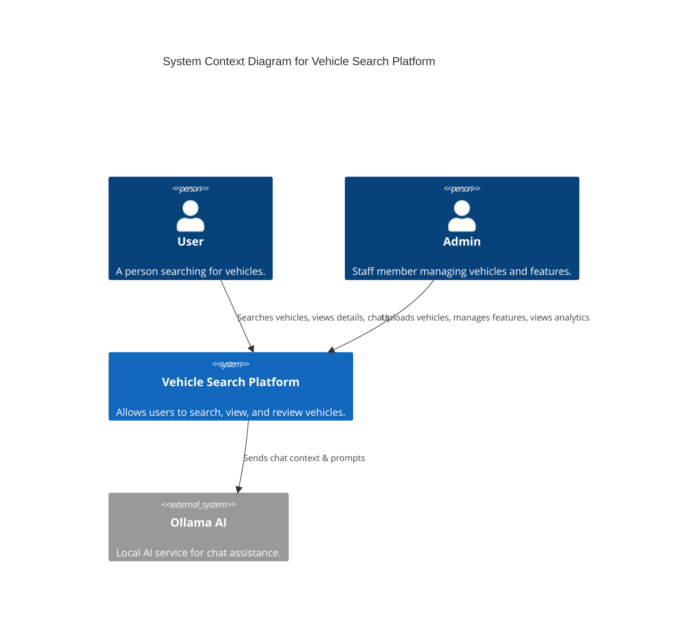
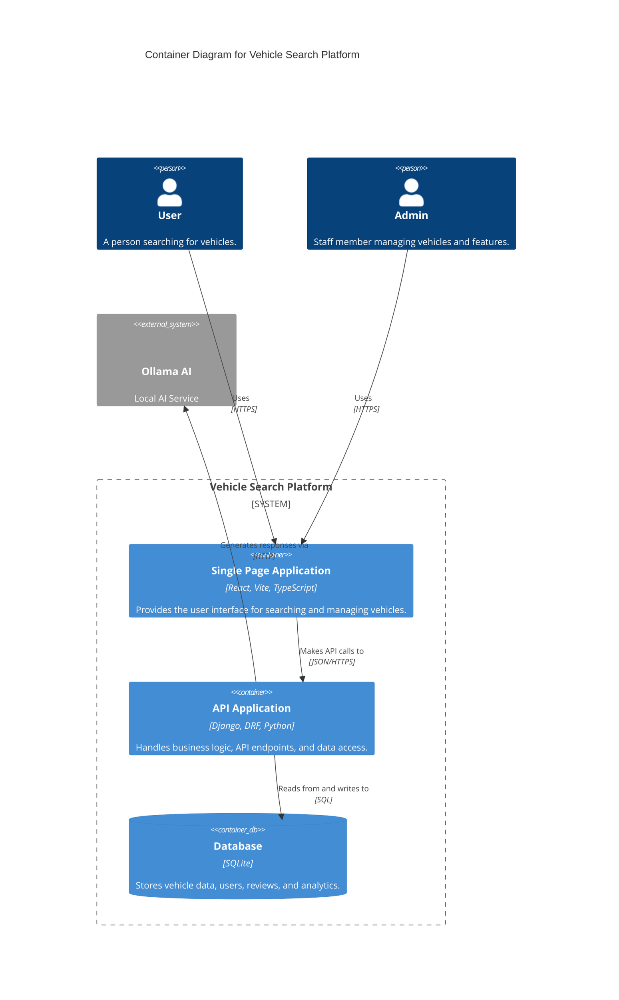

# C4 Diagrams

These diagrams describe the software architecture of the Vehicle Search Platform using the C4 model.

## System Context Diagram

```mermaid
C4Context
    title System Context Diagram for Vehicle Search Platform

    Person(user, "User", "A person searching for vehicles.")
    Person(admin, "Admin", "Staff member managing vehicles and features.")
    
    System(vsp, "Vehicle Search Platform", "Allows users to search, view, and review vehicles.")
    
    System_Ext(ollama, "Ollama AI", "Local AI service for chat assistance.")

    Rel(user, vsp, "Searches vehicles, views details, chats")
    Rel(admin, vsp, "Uploads vehicles, manages features, views analytics")
    Rel(vsp, ollama, "Sends chat context & prompts")
```

## Container Diagram

```mermaid
C4Container
    title Container Diagram for Vehicle Search Platform

    Person(user, "User", "A person searching for vehicles.")
    Person(admin, "Admin", "Staff member managing vehicles and features.")

    System_Boundary(c1, "Vehicle Search Platform") {
        Container(spa, "Single Page Application", "React, Vite, TypeScript", "Provides the user interface for searching and managing vehicles.")
        Container(api, "API Application", "Django, DRF, Python", "Handles business logic, API endpoints, and data access.")
        ContainerDb(db, "Database", "SQLite", "Stores vehicle data, users, reviews, and analytics.")
    }

    System_Ext(ollama, "Ollama AI", "Local AI Service", "Provides LLM capabilities for chat.")

    Rel(user, spa, "Uses", "HTTPS")
    Rel(admin, spa, "Uses", "HTTPS")
    
    Rel(spa, api, "Makes API calls to", "JSON/HTTPS")
    Rel(api, db, "Reads from and writes to", "SQL")
    Rel(api, ollama, "Generates responses via", "HTTP")
```
