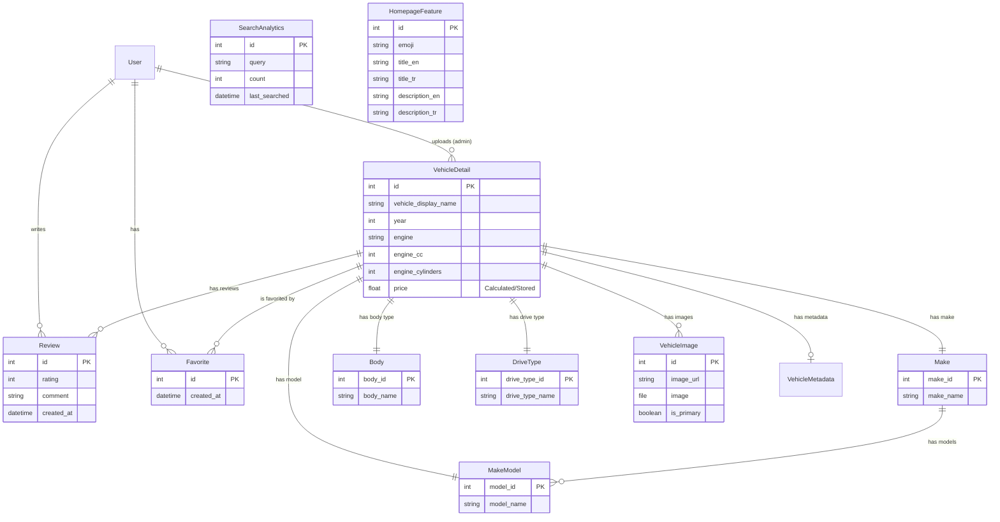

# Entity Relationship Diagram (ERD)

This diagram represents the database schema for the Vehicle Search Platform.

```mermaid
erDiagram
    User ||--o{ Review : writes
    User ||--o{ Favorite : has
    User ||--o{ VehicleDetail : "uploads (admin)"
    
    VehicleDetail ||--|| Make : "has make"
    VehicleDetail ||--|| MakeModel : "has model"
    VehicleDetail ||--|| Body : "has body type"
    VehicleDetail ||--|| DriveType : "has drive type"
    VehicleDetail ||--o{ VehicleImage : "has images"
    VehicleDetail ||--o{ Review : "has reviews"
    VehicleDetail ||--o{ Favorite : "is favorited by"
    VehicleDetail ||--o| VehicleMetadata : "has metadata"

    Make ||--o{ MakeModel : "has models"

    VehicleDetail {
        int id PK
        string vehicle_display_name
        int year
        string engine
        int engine_cc
        int engine_cylinders
        float price "Calculated/Stored"
    }

    Make {
        int make_id PK
        string make_name
    }

    MakeModel {
        int model_id PK
        string model_name
    }

    Body {
        int body_id PK
        string body_name
    }

    DriveType {
        int drive_type_id PK
        string drive_type_name
    }

    VehicleImage {
        int id PK
        string image_url
        file image
        boolean is_primary
    }

    Review {
        int id PK
        int rating
        string comment
        datetime created_at
    }

    Favorite {
        int id PK
        datetime created_at
    }

    SearchAnalytics {
        int id PK
        string query
        int count
        datetime last_searched
    }

    HomepageFeature {
        int id PK
        string emoji
        string title_en
        string title_tr
        string description_en
        string description_tr
    }
```
