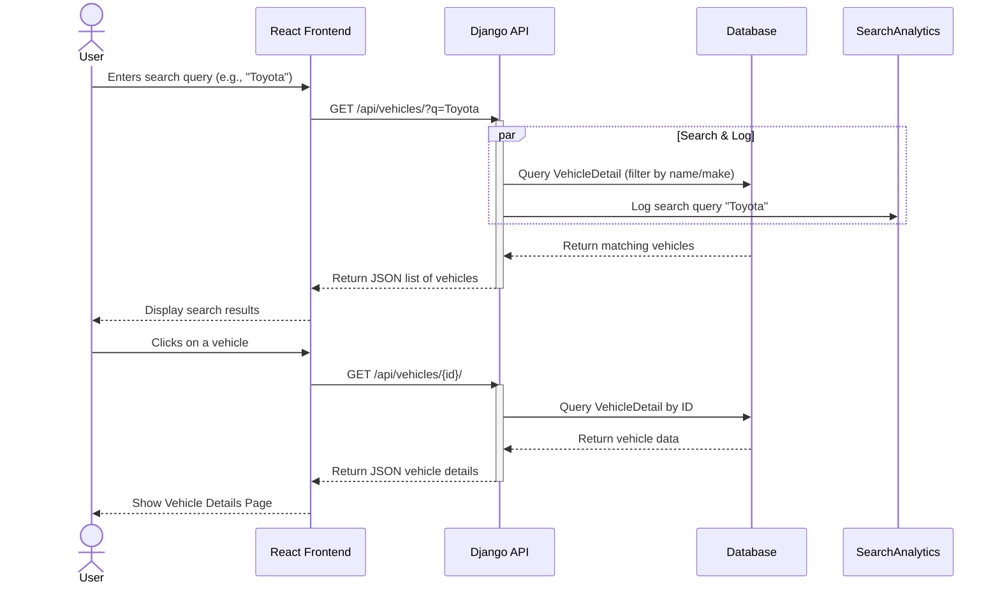

# Sequence Diagram: Search & View Vehicle

This diagram illustrates the flow when a user searches for a vehicle and views its details.

```mermaid
sequenceDiagram
    actor User
    participant ReactUI as React Frontend
    participant API as Django API
    participant DB as Database
    participant Analytics as SearchAnalytics

    User->>ReactUI: Enters search query (e.g., "Toyota")
    ReactUI->>API: GET /api/vehicles/?q=Toyota
    activate API
    
    par Search & Log
        API->>DB: Query VehicleDetail (filter by name/make)
        API->>Analytics: Log search query "Toyota"
    end
    
    DB-->>API: Return matching vehicles
    API-->>ReactUI: Return JSON list of vehicles
    deactivate API
    
    ReactUI-->>User: Display search results
    
    User->>ReactUI: Clicks on a vehicle
    ReactUI->>API: GET /api/vehicles/{id}/
    activate API
    API->>DB: Query VehicleDetail by ID
    DB-->>API: Return vehicle data
    API-->>ReactUI: Return JSON vehicle details
    deactivate API
    
    ReactUI-->>User: Show Vehicle Details Page
```
